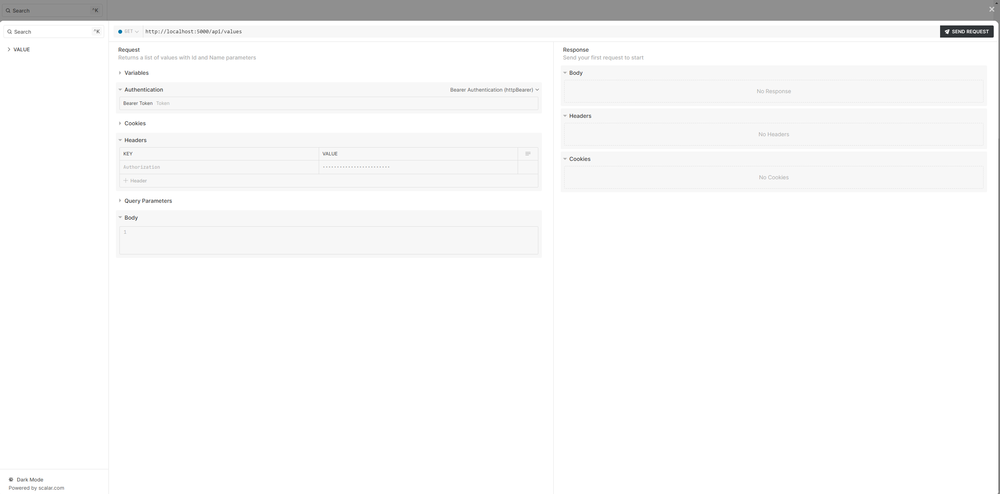

# Scalar.Net


This project is a simple middleware that will expose [Scalar](https://github.com/scalar/scalar/) documentation for your .NET API on the route which you want for your `Swagger/OpenApi` specs.

# Installation
You can install this easily from Nuget on the following location:

[](https://www.nuget.org/packages/Scalar.Net/)

# Usage
After installation you'll need to alter your startup and add `Scalar` to the services. You can to this by calling next method:

```csharp
//map configuration to scalar options
builder.Services.AddScalar(opts => builder.Configuration.GetSection("Scalar").Bind(opts));

//or manually set them
builder.Services.AddScalar(opts => 
{
    opts.Theme = ScalarLayoutType.Modern;
});
```

Available configuration options are located [here](./src/Scalar.Net/ScalarConfigurationOptions.cs). And they closely mimic the configuration on the related node packages over on original Scalar repository.

After configuring options be sure to also include Scalar middlware in your pipeline in order to show the documentation. You can do this by simply calling next method:

```csharp
//map scalar endpoint wherever you want
app.Map("/docs", a =>
{
    a.UseScalar();
});
```

And that is it. Simply visit the related endpoint and you should see your spec generate the related documentation and run the Scalar app in browser.

# Examples
Examples directory contains a sample project which has swagger and scalar integrated so you can more closely follow how to set this up. Few images of this can be found below:

Documentation page:


Documentation request editor:


# License
MIT